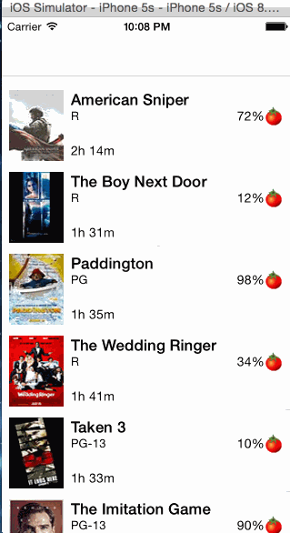

# RottenMovies (RottenTomatoes client Demo)

This is an iOS demo application for displaying the Rotten Tomatoes Box office Movies list using the [RottenTomatoes API](http://www.rottentomatoes.com/).

Time spent: 16 hours spent in total

Completed user stories:

 Basic User Stories:
 * [x] Required: User can view a list of movies from Rotten Tomatoes. Poster images must be loading asynchronously.
 * [x] Required: User can view movie details by tapping on a cell.
 * [x] Required: User sees loading state while waiting for movies API.
 * [x] Required: User sees error message when there's a networking error
 * [x] Required: User can pull to refresh the movie list. (Used UIRefreshControl)
 * [x] Optional: All images fade in
 * [x] Optional: For the large poster, load the low-res image first, switch to high-res when complete

Notes:

Spent time understanding the basic working of tableview, and how to work with the xib files.
Also understood how to download images asynchronously and how to use low quality images as placeloaders.

Had difficulty in trying to get the custom view for network error working.

Walkthrough of all user stories:

GIF created with [LiceCap](http://www.cockos.com/licecap/).